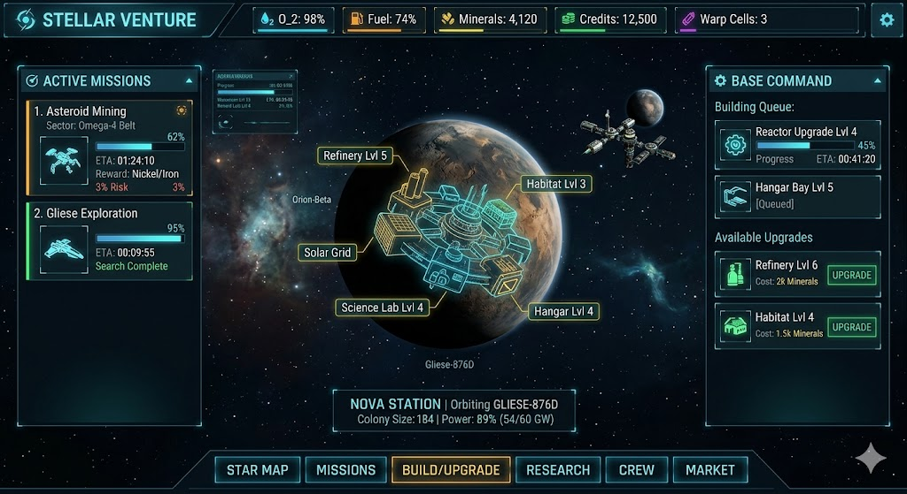

# UI — Hub Screen (target vision)

> This doc captures the **target** main-menu layout we are building toward.
> It is NOT the current state — the current start screen is a 3×3 Pixi mission
> board with a side MISSION LOG. The hub is the destination; we will migrate
> toward it in small phased PRs (see `ROADMAP.md`).
>
> Ground-truth reference image: [`images/hub-vision.png`](images/hub-vision.png)
> (this is a reference mock — not a pixel-perfect target, just the shape of the screen)



---

## Shape of the screen

Five distinct zones, always visible:

```
 ┌──────────────────────────────────────────────────────────────────────┐
 │ TOP BAR: brand + resource strip + settings gear                      │ ← always
 ├──────────────┬───────────────────────────────────┬───────────────────┤
 │              │                                   │                   │
 │ LEFT         │       CENTER (tab content)        │ RIGHT             │
 │ Active       │                                   │ Base Command      │
 │ Missions     │   (swaps with bottom nav tab)     │                   │
 │              │                                   │                   │
 │              │                                   │                   │
 ├──────────────┴───────────────────────────────────┴───────────────────┤
 │ BOTTOM NAV: STAR MAP · MISSIONS · BUILD/UPGRADE · RESEARCH · CREW …  │ ← always
 └──────────────────────────────────────────────────────────────────────┘
```

- **Left and right columns are persistent context** — they reflect live state
  regardless of which tab is active in the center. Active missions keep ticking
  while you're on RESEARCH. Building queue keeps ticking while you're on STAR MAP.
- **Center is the only tab-swapped region.**
- **Nothing about the hub is modal.** Running a mission enters a different scene
  (the current puzzle board); returning to the hub restores the same state.

---

## Zones, element by element

### 1. Top bar — resource strip

Left to right:

- **Brand mark** — game title + small icon. Reactive star actor can live here
  (same one currently in the start screen title).
- **Resource readouts** — one chip per tracked resource. Each chip: small icon +
  label + value. Mix of **percentages** (ship/station stats) and **integers**
  (bankable currencies).

Resource strip in the reference mock (final list TBD as we tune the economy):

| Icon | Resource | Kind | Example shown |
|---|---|---|---|
| droplet | **O₂** | ship stat, % | `98%` |
| fuel pump | **Fuel** | ship stat, % | `74%` |
| ore | **Minerals** | bankable, integer | `4,120` |
| coin | **Credits** | bankable, integer | `12,500` |
| bolt | **Warp Cells** | bankable, small integer | `3` |

Chip behavior:

- Value changes pulse briefly (same event-driven repaint pattern the HUD uses).
- Below-threshold values (e.g. O₂ < 20%) tint red.
- Clicking a chip opens a one-line tooltip explaining what the resource gates.

- **Settings gear** — rightmost. Opens a modal with sound toggle, reset-profile
  confirmation, credits (the project kind), link to docs.

### 2. Left column — ACTIVE MISSIONS

Header: `ACTIVE MISSIONS` with small chevron / count badge.

Each card in the list represents one **in-flight** mission:

```
┌────────────────────────────────────┐
│ 1. Asteroid Mining             ★   │  ← slot number + name + risk/priority icon
│    Sector: Omega-4 Belt            │  ← location / parent body
│    ████████████░░░░░  62%          │  ← progress bar
│    ETA: 01:24:10                   │  ← countdown to completion
│    Reward: Nickel/Iron             │  ← ore preview
│    Risk: 3%                        │  ← failure chance (optional per mission)
│    [ ship silhouette ]             │
└────────────────────────────────────┘
```

States:

- **In progress** — animated progress bar + ticking ETA.
- **Complete** — progress bar full, label swaps to `Search Complete` /
  `Haul Ready`, card gets a glowing border; clicking opens the **results
  screen** (same one from P1) and then returns to the hub with rewards applied.
- **Failed** — analogous with red glow; rewards forfeit, some fuel lost.
- **Empty slot** — stub card with `+ Deploy` button that routes to the MISSIONS
  tab.

This panel is an **idle UI** — missions tick even while the puzzle is not being
played. The actual puzzle is only played for the "active run" (one at a time,
center screen). Passive missions are separate from active puzzle runs.

### 3. Center — tab content

One panel at a time, driven by the bottom nav. At boot it shows **STAR MAP**
(the station view in the reference mock is actually part of the BUILD/UPGRADE
tab, selected in the screenshot).

The six tab-panels:

- **STAR MAP** — galactic map view. Sectors, current ship position, known
  asteroids. Clicking a sector opens a detail with a `Deploy` action.
- **MISSIONS** — list of **available** missions. This is where today's 3×3
  mission board lives in the long run; each mission launches a puzzle run.
- **BUILD/UPGRADE** — station diorama with labeled buildings (reference mock:
  Refinery Lv5, Habitat Lv3, Solar Grid, Science Lab Lv4, Hangar Lv4). Each
  building is clickable; clicking pops a detail card. Station info strip at
  the bottom: `NOVA STATION | Orbiting GLIESE-876D | Colony Size: 184 | Power: 89% (54/60 GW)`.
- **RESEARCH** — tech tree. Unlocks grid-wide perks (bigger bomb, longer snake,
  faster auto-match, bonus ore %).
- **CREW** — hired dispatchers / operators. Each has a skill that modifies a
  specific mission archetype.
- **MARKET** — ore ↔ credits trader. Current prices drift daily.

All six tabs exist in the target design. We **do not need all six in the first
hub PR** — MISSIONS and BUILD/UPGRADE are enough to validate the scene graph;
the others can be stub panels saying "Unlocks at Rep Tier N".

### 4. Right column — BASE COMMAND

Header: `BASE COMMAND`.

Two stacked sub-sections:

**Building Queue**
```
┌────────────────────────────────────┐
│ [gear icon] Reactor Upgrade Lvl 4  │ ← active build
│ Progress: ██████░░░░░░░ 45%        │
│ ETA: 00:41:20                      │
├────────────────────────────────────┤
│ Hangar Bay Lvl 5 [Queued]          │ ← waiting
└────────────────────────────────────┘
```

- One active build at a time (configurable later); rest queue.
- Active item has ETA + progress bar; queued items have `[Queued]`.
- Clicking an item: active → cancel confirm; queued → reorder / remove.
- Completion event emits a top-bar toast and auto-starts the next queued item.

**Available Upgrades**
```
┌────────────────────────────────────┐
│ [flask icon] Refinery Lvl 6        │
│ Cost: 2k Minerals       [UPGRADE]  │
├────────────────────────────────────┤
│ [house icon] Habitat Lvl 4         │
│ Cost: 1.5k Minerals     [UPGRADE]  │
└────────────────────────────────────┘
```

- Rows are **the next purchasable level** of each building the player owns.
- `UPGRADE` button disables when cost exceeds current resources; enables as
  resources climb.
- Clicking a row (not the button) opens a detail panel in the center: what this
  level changes, base stats, upgrade history.

### 5. Bottom nav — tab switcher

Six pill-shaped buttons: `STAR MAP · MISSIONS · BUILD/UPGRADE · RESEARCH · CREW · MARKET`.
Active tab is highlighted (orange fill + white text in the mock; we'll use our
existing cyan accent for consistency).

- Left-most button is always the default (STAR MAP).
- Keyboard shortcuts: `1`–`6` jump to the corresponding tab.
- Mobile: horizontal scroll if the screen is too narrow. (Deferred — desktop
  first.)

- Small decorative star actor on the far right of the nav, echoing the brand.

---

## Information density vs. the current start screen

Today's start screen has 2 zones (mission grid + MISSION LOG) crammed into an
~860×820 fixed panel. The hub has **5 zones + 6 tab-panels**. Two implications:

1. **The hub must be viewport-filling.** Not a fixed panel floating on a black
   background. That's what the current centering bug is hinting at — fixed
   panel sizes break on wide monitors.
2. **The hub is not a single `_buildStartScreen()` call.** It's a scene with
   child containers per zone and per tab, each owning its own repaint lifecycle.
   Separating these is the first structural PR on the way to the hub.

See `ARCHITECTURE.md` for the scene-graph shape we'll adopt.

---

## Data model impact

The hub needs more state than the current `GameState`. New pure modules needed
before the hub can be real:

- **`MetaState`** — bankable resources (credits, ores, minerals, fuel, O₂,
  warp cells), rep tier, owned buildings + levels, research unlocks, hired
  crew, known sectors. The legacy `HighScores` module has been deleted; personal
  bests, if they come back, will be an opt-in read-out of `MetaState` (not a
  separate storage module). Session-scope stub planned in `ROADMAP.md` P1;
  full persistent version lands in P3.
- **`MissionRegistry`** — active missions (with remaining ETA + seeded reward
  roll), available missions, completed mission history. Drives both the left
  and MISSIONS-tab panels.
- **`BuildQueue`** — active build, queued items, per-building level state.
  Drives the right panel.
- **`IdleClock`** — single scheduler advancing `MetaState` + `MissionRegistry`
  + `BuildQueue` on a tick. Tab-close timestamp to catch up on open.

All of these stay **pure** (no DOM, no `setTimeout`, inject `schedule`) — same
rule as `GameState`.

---

## Phased delivery

Not a single PR. Rough phase mapping (see `ROADMAP.md` for the committed
version):

| Phase | Hub scope |
|---|---|
| P1 | Results screen after a run; session-only ore tally. No hub yet. |
| P2 | Hub scaffolding: viewport-filling scene, top bar (static resource strip), left/right placeholder columns, bottom nav with 6 tab buttons, MISSIONS tab = existing 3×3 board. All read-only. Fixes the current centering + overlap defects as a side effect. |
| P3 | Persistent meta-state (`MetaState`, `persistence.js`) + rep-tier gates on mission cards. |
| P4 | Active-missions panel: idle ticking, ETA, reward-on-complete, deploy-to-run flow. `IdleClock` + `MissionRegistry`. |
| P5 | BUILD/UPGRADE tab: station diorama, building levels, building queue, upgrade costs. `BuildQueue`. |
| P6 | RESEARCH, CREW, MARKET tabs. Rep-tier gating. |
| P7 | STAR MAP tab: sector exploration, mission discovery tied to map. |

Each phase is still a handful of small PRs, not one giant PR.

---

## Non-goals for the hub

- **Not an RTS.** You do not command ships in real-time. Missions are launched,
  return with results. The only real-time interaction is the puzzle run.
- **Not a simulation.** Buildings don't produce ambient particles or NPCs walk
  around. Station view is a diorama, not a living scene.
- **Not animated 3D.** Planet + station are illustrative — parallax drift at
  most, no WebGL shaders beyond what Pixi already does.
- **Not mobile-first.** Desktop target; mobile is a later pass.

---

## Open questions (answer as we go)

- ~~Where do high scores live once MISSION LOG is no longer a side panel?~~
  Answered: **nowhere**. The `HighScores` module was deleted and no
  leaderboard ships. If personal-best recall returns later it will be a
  derived read-out of `MetaState`, not a standalone module.
- Should the results screen (P1) show a "best run on this asteroid" line
  sourced from session `MetaState`? (Leaning: yes, session-only until P3.)
- Are O₂ and Fuel actual mechanics or flavor? If mechanics, what consumes them?
  (Candidate: deploying missions costs fuel; ship repair between missions costs
  credits + O₂ refill.)
- Does the hub auto-pause when the player is in a puzzle run, or do idle
  missions tick during the run? (Leaning: tick during run, cap the tick so
  offline catch-up doesn't trivialize the loop.)
- What's the max concurrent active missions? (Leaning: 3, upgradeable via
  Hangar level.)
