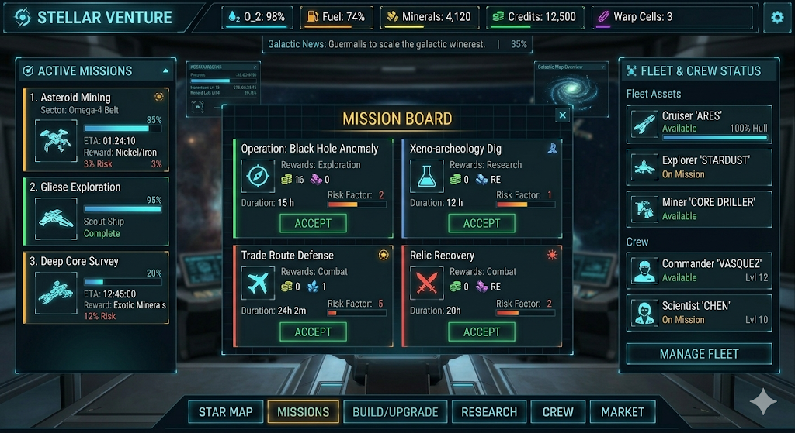

# UI — Hub Screen (target vision)

> This doc captures the **target** main-menu layout we are building toward.
> It is NOT the current state — today's start screen is a single centered
> Pixi panel with a 3×3 mission grid and a dispatcher identity card. The
> hub is the destination; we will migrate toward it in small phased PRs
> (see [`ROADMAP.md`](ROADMAP.md)).
>
> Ground-truth reference: [`images/hub-mission-board-mock.png`](images/hub-mission-board-mock.png)
> (a reference mock — not a pixel-perfect target, just the shape of the screen).
> The earlier `images/hub-vision.png` mock is superseded by this one; see
> [ADR-0007](adr/0007-hub-wireframe-pivot.md) for what changed.



---

## Shape of the screen

Five persistent zones + one modal overlay:

```
 ┌──────────────────────────────────────────────────────────────────────┐
 │ TOP BAR: brand + resource strip + settings gear                      │ ← always
 ├──────────────────────────────────────────────────────────────────────┤
 │ GALACTIC NEWS ticker (one scrolling line)                            │ ← always
 ├──────────────┬───────────────────────────────────┬───────────────────┤
 │              │                                   │                   │
 │ LEFT         │       CENTER (tab content)        │ RIGHT             │
 │ Active       │                                   │ Fleet & Crew      │
 │ Missions     │   (swaps with bottom nav tab)     │ Status            │
 │              │                                   │                   │
 │              │    ┌─────────────────────────┐    │                   │
 │              │    │  MISSION BOARD modal    │    │                   │ ← MISSIONS tab only
 │              │    │  (2×2 narrative cards)  │    │                   │   (floats over center)
 │              │    └─────────────────────────┘    │                   │
 │              │                                   │                   │
 ├──────────────┴───────────────────────────────────┴───────────────────┤
 │ BOTTOM NAV: STAR MAP · MISSIONS · BUILD/UPGRADE · RESEARCH · CREW …  │ ← always
 └──────────────────────────────────────────────────────────────────────┘
```

- **Left and right columns are persistent context** — they reflect live state
  regardless of which tab is active in the center. Active missions keep
  ticking while you're on RESEARCH. Fleet hull % keeps updating while you're
  on STAR MAP.
- **Center is the only tab-swapped region.**
- **Mission Board is a modal over the MISSIONS tab** — it floats above a
  static galactic-map backdrop + the Galactic News ticker. ESC or clicking
  the backdrop dismisses it. This is the one place in the hub with modal
  chrome; everything else is in-place navigation.
- **The puzzle run is a separate scene** — clicking ACCEPT on a mission card
  transitions out of the hub into the existing game scene. Returning routes
  to the results screen (P1) and then back to the hub.

---

## Zones, element by element

### 1. Top bar — resource strip

Left to right:

- **Brand mark** — `STELLAR VENTURE` title + reactive star actor (the same
  actor currently used in the transitional start screen).
- **Resource readouts** — one chip per tracked resource. Each chip: small
  icon + label + value. Mix of **percentages** (ship/station stats) and
  **integers** (bankable currencies).

Resource strip in the reference mock (final list TBD as we tune the economy):

| Icon | Resource | Kind | Example shown |
|---|---|---|---|
| droplet | **O₂** | ship stat, % | `98%` |
| fuel pump | **Fuel** | ship stat, % | `74%` |
| ore | **Minerals** | bankable, integer | `4,120` |
| coin | **Credits** | bankable, integer | `12,500` |
| bolt | **Warp Cells** | bankable, small integer | `3` |

Chip behavior:

- Value changes pulse briefly (same event-driven repaint pattern the HUD uses).
- Below-threshold values (e.g. O₂ < 20%) tint red.
- Clicking a chip opens a one-line tooltip explaining what the resource gates.

- **Settings gear** — rightmost. Opens a modal with sound toggle, reset-profile
  confirmation, credits (the project kind), link to docs.

### 2. Galactic News ticker

One scrolling line directly under the top bar. Always present, ~28 px tall.

Content comes from a small rotating pool of flavor strings + runtime
events. Examples:

- `⚡ Fuel prices up 3% in Outer Rim — switch carriers if you can.`
- `⚠ Solar flare active near Gliese Fringe — missions here risk +5%.`
- `★ Scout "Magellan" completed exploration of Omega-4 Belt.`
- `⛏ Refinery upgrade completed: Lv6 online.`

Ticker scrolls right-to-left at a constant speed; gameplay events emit
higher-priority items that jump to the front.

Disable from settings if noisy. Purely flavor + feedback — **no input
lives here**.

### 3. Left column — ACTIVE MISSIONS

Header: `ACTIVE MISSIONS` with small chevron / count badge.

Each card in the list represents one **in-flight** mission:

```
┌────────────────────────────────────┐
│ 1. Asteroid Mining             ★   │  ← slot number + name + risk/priority icon
│    Sector: Omega-4 Belt            │  ← location / parent body
│    ████████████░░░░░  62%          │  ← progress bar
│    ETA: 01:24:10                   │  ← countdown to completion
│    Reward: Nickel/Iron             │  ← ore preview
│    Risk: 3%                        │  ← failure chance
│    [ ship silhouette ]             │
└────────────────────────────────────┘
```

States:

- **In progress** — animated progress bar + ticking ETA.
- **Complete** — progress bar full, label swaps to `Search Complete` /
  `Haul Ready`, card gets a glowing border; clicking opens the **results
  screen** (same one from P1) and then returns to the hub with rewards applied.
- **Failed** — analogous with red glow; rewards forfeit, some fuel lost.
- **Empty slot** — stub card with `+ Deploy` button that routes to the
  MISSIONS tab and opens the mission board modal.

This panel is an **idle UI** — missions tick even while the player is
on another hub tab. The puzzle is only played for the **active run**
(one at a time, foreground scene). Passive missions are separate from
active puzzle runs — click ACCEPT on a card in the MISSION BOARD modal
and the run starts immediately; idle missions are for a later phase
(see `ROADMAP.md` P4).

### 4. Center — tab content

One panel at a time, driven by the bottom nav. At boot the **MISSIONS**
tab is active and the mission board modal is open. Dismissing the modal
leaves the MISSIONS tab showing the static galactic-map backdrop.

The six tab-panels:

- **STAR MAP** — galactic map view. Sectors, current ship position, known
  asteroids. Clicking a sector opens a detail with a `Deploy` action.
- **MISSIONS** — default tab. Static galactic-map backdrop + `MISSION
  BOARD` modal overlay (see §5 below). The backdrop hints that sectors
  feed missions — P7 wires them together.
- **BUILD/UPGRADE** — station diorama with labeled buildings (reference
  mock: Refinery Lv5, Habitat Lv3, Solar Grid, Science Lab Lv4, Hangar
  Lv4). Each building is clickable; clicking pops a detail card. Station
  info strip at the bottom: `NOVA STATION | Orbiting GLIESE-876D |
  Colony Size: 184 | Power: 89% (54/60 GW)`. Build queue + available
  upgrade list (formerly on the persistent right column) live inside
  this tab — see [ADR-0007](adr/0007-hub-wireframe-pivot.md) for the
  pivot rationale.
- **RESEARCH** — tech tree. Unlocks grid-wide perks (bigger bomb, longer
  snake, faster auto-match, bonus ore %).
- **CREW** — hired dispatchers / operators. Each has a skill that
  modifies a specific mission archetype. Cross-references the right
  column's FLEET & CREW STATUS.
- **MARKET** — ore ↔ credits trader. Current prices drift daily.

All six tabs exist in the target design. We **do not need all six in
the first hub PR** — MISSIONS (with the mission board modal) is enough
to ship a playable hub. The other five render a `Unlocks at Rep Tier N`
stub panel until their phase lands.

### 5. MISSION BOARD modal (MISSIONS tab default overlay)

Floating panel over the MISSIONS tab. 2×2 grid of narrative mission
cards in the mock; final card count tuned per session roll (4–8 visible,
scrollable if more). See §7 below for the full catalog.

Modal structure:

```
┌─ MISSION BOARD ────────────────────── ×  ┐
│                                          │
│  ┌──────────────────┐ ┌───────────────┐  │
│  │ Op: Black Hole   │ │ Xeno-arch Dig │  │
│  │ Exploration      │ │ Research      │  │
│  │ Risk: 2  15h     │ │ Risk: 1  12h  │  │
│  │ [ore preview]    │ │ [ore preview] │  │
│  │ [ ACCEPT ]       │ │ [ ACCEPT ]    │  │
│  └──────────────────┘ └───────────────┘  │
│  ┌──────────────────┐ ┌───────────────┐  │
│  │ Trade Route Def  │ │ Relic Recov.  │  │
│  │ Combat           │ │ Salvage       │  │
│  │ Risk: 5  24h 2m  │ │ Risk: 2  20h  │  │
│  │ [ore preview]    │ │ [ore preview] │  │
│  │ [ ACCEPT ]       │ │ [ ACCEPT ]    │  │
│  └──────────────────┘ └───────────────┘  │
│                                          │
│  Refreshes in 14h 32m · [ REROLL (25c) ] │
└──────────────────────────────────────────┘
```

Card elements (one per card):

- **Name** — flavor name. `Operation: Black Hole Anomaly`, `Xeno-archeology
  Dig`, `Trade Route Defense`, `Relic Recovery`, etc. See §7 for the
  canonical catalog.
- **Type tag** — one of: `Mining` · `Exploration` · `Research` · `Salvage` ·
  `Combat`. Drives the icon and the tier mapping.
- **Sector** — parent body / location string. `Omega-4 Belt`, `Gliese
  Fringe`, `Voidwreck`, etc. Stable per session.
- **Risk factor** — 1–5 stars (or a single integer). Hidden lookup to
  tier index underneath; 1 = T1/T2, 5 = T9.
- **Duration ETA** — flavor countdown (`15h`, `12h`, `24h 2m`, `20h`).
  Purely decorative in P2 (instant-run on ACCEPT); wires into the idle
  tick in P4.
- **Reward preview** — 2–4 ore icons with expected counts (e.g. `◆ Pyrite
  ×80 · ◆ Helium ×40`). Credit line below. Collapsed-complexity missions
  show rare ores (Volatiles, Biomass).
- **ACCEPT button** — primary verb. Click → the puzzle scene launches
  with the card's `gameConfig` (mode / complexity / field size from the
  mapped tier archetype).

Modal behavior:

- Opens automatically when the MISSIONS tab activates at boot.
- Dismissed by the `×`, by ESC, or by clicking outside the panel.
- **REROLL** button costs a small credit amount; re-rolls all visible
  cards while keeping any `ACCEPT`-ed ones intact. Catalog rotation
  lands in P4 with real idle cadence; placeholder freebie in P2.

### 6. Right column — FLEET & CREW STATUS

> Replaces the earlier "BASE COMMAND" spec (build queue + upgrade list
> on the persistent right column). The queue + upgrade list moved into
> the BUILD/UPGRADE tab per [ADR-0007](adr/0007-hub-wireframe-pivot.md).

Header: `FLEET & CREW STATUS`.

Two stacked sub-sections.

**Fleet**

One card per ship in the player's fleet. Each card:

```
┌──────────────────────────────┐
│ [icon] Scout "Magellan"      │  ← class + callsign
│        Class: Explorer  Lv3  │  ← type + refit level
│        Hull: ████████░░  82% │  ← hull bar
│        Status: Deployed      │  ← On Station / Deployed / Repairing / Idle
└──────────────────────────────┘
```

Per-ship fields: class (Explorer / Hauler / Destroyer / etc.), callsign,
refit level, hull % with color ramp (green > 60%, yellow 20–60%, red <
20%), availability status. Clicking a ship card opens a detail panel
(future PR — refit, rename, assign crew).

Starter fleet: **3 ships** total (one Explorer, one Hauler, one
multipurpose frigate). Fleet size gates concurrent active missions.

**Crew**

List of hired operators:

```
┌──────────────────────────────┐
│ [portrait] Kira Voss    Lv4  │  ← name + skill level
│            Engineer          │  ← role
│            Status: Assigned  │  ← Assigned / Available / Injured
└──────────────────────────────┘
```

Per-crew fields: name, role (Engineer / Navigator / Scientist /
Gunner / Medic / Archaeologist), skill level, status. Assigned crew
take a bonus on missions whose type matches their role (e.g.
Archaeologist on `Xeno-archeology Dig`).

Starter crew: **3 members** (1 Engineer, 1 Navigator, 1 Scientist) plus
the player as **Chief Dispatcher** (not a crew card — lives in the top
bar brand area).

FLEET & CREW ticks live — hull repair, return-from-mission status
updates — in P4. For P2 scaffolding this is a static readout.

### 7. Narrative mission catalog

9 narrative missions, one per tier archetype in `HIGHSCORE_TIERS`
(`src/constants.js`). Each narrative mission is a **flavor skin** over a
`gameConfig = { mode, complexity, fieldSize }` triple; the puzzle run
stays identical to today's. The mission board modal shows a rotating
subset (4–8 cards) per session roll.

Design rules:

- **Exactly one narrative mission per tier archetype.** No two narrative
  missions map to the same tier. The tier order in `HIGHSCORE_TIERS`
  (easy → hard) stays the source of truth; the narrative name is
  decorative.
- **Mission type** correlates loosely with mode/complexity but is not a
  hard rule — it's a flavor bucket for crew-bonus matching.
- **Risk factor** (1–5) maps to tier index bucket: T1–T2 = 1, T3–T4 = 2,
  T5 = 3, T6–T7 = 4, T8–T9 = 5.
- **Duration ETA** is flavor only in P2/P3 (run starts on ACCEPT). Used
  as the idle-mission timer when P4 lands. Scales with tier index —
  harder missions advertise longer ETAs so the idle loop rewards
  patience.
- **Ore preview** reads from the tier's complexity: Classic previews
  common ores (Pyrite, Cryonite, Verdanite, Helium); Mutated mixes all
  four commons; Collapsed previews the two rare ores (Volatiles, Biomass)
  since that's the only complexity where bomb/snake tiles spawn.

Canonical catalog (order matches `HIGHSCORE_TIERS` easy → hard):

| # | Tier id               | Narrative name                         | Type        | Sector               | Risk | ETA    | Ore preview                 |
|---|-----------------------|----------------------------------------|-------------|----------------------|------|--------|-----------------------------|
| 1 | `stellar-classic`     | **Asteroid Mining: Omega-4 Belt**      | Mining      | Omega-4 Belt         | 1    | 8h     | Pyrite, Helium              |
| 2 | `stellar-mutated`     | **Ice-Shard Harvest: Gliese Fringe**   | Mining      | Gliese Fringe        | 1    | 12h    | Cryonite, Verdanite, Helium |
| 3 | `auto-match-classic`  | **Gliese Exploration: Scout Sweep**    | Exploration | Gliese-876 System    | 2    | 12h    | Pyrite, Cryonite            |
| 4 | `auto-match-mutated`  | **Xeno-archeology Dig: Uncharted Crag**| Research    | Kuiper Fringe        | 2    | 16h    | Verdanite, Helium, Pyrite   |
| 5 | `stellar-collapsed`   | **Operation: Black Hole Anomaly**      | Exploration | Event Horizon Shadow | 3    | 15h    | Volatiles, Biomass          |
| 6 | `auto-match-collapsed`| **Relic Recovery: Voidwreck**          | Salvage     | Voidwreck Field      | 4    | 20h    | Volatiles, Biomass          |
| 7 | `blocks-classic`      | **Trade Route Defense: Outer Rim**     | Combat      | Outer Rim Lanes      | 4    | 18h    | Pyrite, Helium, Cryonite    |
| 8 | `blocks-mutated`      | **Deep Core Survey: Seismic Rift**     | Exploration | Seismic Rift         | 5    | 22h    | Verdanite, Pyrite, Helium   |
| 9 | `blocks-collapsed`    | **Core Breach: Terminus Protocol**     | Combat      | Terminus Core        | 5    | 24h 2m | Volatiles, Biomass          |

Implementation note: today's `src/missions.js` already indexes into
`HIGHSCORE_TIERS` and exposes `ASTEROID_NAMES` per tier. The narrative
catalog adds three more fields per tier (`narrativeName`, `type`,
`etaMinutes`) and the session roll picks one narrative per tier. The
puzzle-run `gameConfig` is unchanged — same 9-tier matrix underneath.

### 8. Bottom nav — tab switcher

Six pill-shaped buttons: `STAR MAP · MISSIONS · BUILD/UPGRADE · RESEARCH · CREW · MARKET`.
Active tab is highlighted (orange fill + white text in the mock; we'll use our
existing cyan accent for consistency).

- Default active tab at boot: **MISSIONS** (with the mission board modal
  open). Changed from the earlier "STAR MAP default" — the mission
  board is the primary verb of the game, so it greets the player first.
- Keyboard shortcuts: `1`–`6` jump to the corresponding tab.
- Mobile: horizontal scroll if the screen is too narrow. (Deferred — desktop
  first.)

- Small decorative star actor on the far right of the nav, echoing the brand.

---

## Information density vs. the current start screen

Today's start screen has 2 zones (mission grid + dispatcher identity card)
crammed into an ~860×820 fixed panel. The hub has **5 persistent zones + 1
modal + 6 tab-panels**. Two implications:

1. **The hub must be viewport-filling.** Not a fixed panel floating on a
   black background. That's what the current centering bug is hinting at
   — fixed panel sizes break on wide monitors.
2. **The hub is not a single `_buildStartScreen()` call.** It's a scene
   with child containers per zone, per tab, and per modal, each owning
   its own repaint lifecycle. Separating these is the first structural
   PR on the way to the hub.

See `ARCHITECTURE.md` for the scene-graph shape we'll adopt.

---

## Data model impact

The hub needs more state than the current `GameState`. New pure modules
needed before the hub can be real:

- **`MetaState`** — bankable resources (credits, ores, minerals, fuel,
  O₂, warp cells), rep tier, owned buildings + levels, research
  unlocks, hired crew, known sectors, **fleet (ships + hull %)**. The
  legacy `HighScores` module has been deleted; personal bests, if they
  come back, will be an opt-in read-out of `MetaState` (not a separate
  storage module). Session-scope stub planned in `ROADMAP.md` P1; full
  persistent version lands in P3.
- **`MissionRegistry`** — active missions (with remaining ETA + seeded
  reward roll), available missions (narrative catalog + session roll),
  completed mission history. Drives the left column and the MISSION
  BOARD modal.
- **`FleetRegistry`** — ships + crew + assignments. Drives the right
  column. Owns hull %, refit level, crew roster, assignment → mission
  bindings.
- **`BuildQueue`** — active build, queued items, per-building level
  state. Drives the BUILD/UPGRADE tab.
- **`IdleClock`** — single scheduler advancing `MetaState` +
  `MissionRegistry` + `FleetRegistry` + `BuildQueue` on a tick.
  Tab-close timestamp to catch up on open.
- **`NewsFeed`** — small rotating pool of flavor strings + high-priority
  runtime events. Drives the Galactic News ticker.

All of these stay **pure** (no DOM, no `setTimeout`, inject `schedule`) —
same rule as `GameState`.

---

## Phased delivery

Not a single PR. Rough phase mapping (see `ROADMAP.md` for the committed
version):

| Phase | Hub scope |
|---|---|
| P1 | Results screen after a run; session-only ore tally. No hub yet. |
| P2 | Hub scaffolding: viewport-filling scene, top bar (static resource strip), Galactic News ticker (static pool), left ACTIVE MISSIONS empty-state, right FLEET & CREW STATUS with starter fleet/crew readouts, bottom nav with 6 tab buttons, MISSIONS tab + MISSION BOARD modal hosting the narrative mission catalog. All read-only. Fixes the current centering defect as a side effect. |
| P3 | Persistent `MetaState` + `FleetRegistry` + `persistence.js`; rep-tier gates on narrative mission cards; session-carried fleet/crew state. |
| P4 | Active-missions idle tick (`IdleClock`, `MissionRegistry`): left column ticks ETAs; completion → results → hub with rewards; FLEET & CREW status updates on return (hull damage, crew injured). |
| P5 | BUILD/UPGRADE tab: station diorama, per-building levels, build queue, upgrade list (was previously persistent right column). `BuildQueue`. |
| P6 | RESEARCH, CREW, MARKET tabs. Rep-tier gating. |
| P7 | STAR MAP tab: sector exploration, mission discovery tied to map. |

Each phase is still a handful of small PRs, not one giant PR.

---

## Non-goals for the hub

- **Not an RTS.** You do not command ships in real-time. Missions are
  launched, return with results. The only real-time interaction is the
  puzzle run.
- **Not a simulation.** Buildings don't produce ambient particles, NPCs
  don't walk around. Station view is a diorama, not a living scene.
- **Not animated 3D.** Planet + station are illustrative — parallax
  drift at most, no WebGL shaders beyond what Pixi already does.
- **Not a dialogue-driven narrative.** Mission cards have one-line
  flavor briefs; no VO, no NPC portraits with speech bubbles, no
  branching conversations.
- **Not mobile-first.** Desktop target; mobile is a later pass.

---

## Open questions (answer as we go)

- ~~Where do high scores live once MISSION LOG is no longer a side panel?~~
  Answered: **nowhere**. The `HighScores` module was deleted and no
  leaderboard ships. If personal-best recall returns later it will be a
  derived read-out of `MetaState`, not a standalone module.
- ~~Is the right column BASE COMMAND (build queue + upgrade list) or
  FLEET & CREW STATUS?~~ Answered: **FLEET & CREW STATUS**. Build queue
  and upgrade list move inside the BUILD/UPGRADE tab. See
  [ADR-0007](adr/0007-hub-wireframe-pivot.md).
- Should the results screen (P1) show a "best run on this asteroid" line
  sourced from session `MetaState`? (Leaning: yes, session-only until P3.)
- Are O₂ and Fuel actual mechanics or flavor? If mechanics, what consumes
  them? (Candidate: deploying missions costs fuel; ship repair between
  missions costs credits + O₂ refill.)
- Does the hub auto-pause when the player is in a puzzle run, or do idle
  missions tick during the run? (Leaning: tick during run, cap the tick
  so offline catch-up doesn't trivialize the loop.)
- What's the max concurrent active missions? (Leaning: 3, upgradeable
  via Hangar level + fleet size.)
- Does the narrative catalog rotate between sessions, or only on daily
  reroll? (Leaning: per-session-roll picks one narrative per tier; daily
  reroll swaps the sector + ETA, not the narrative name.)
