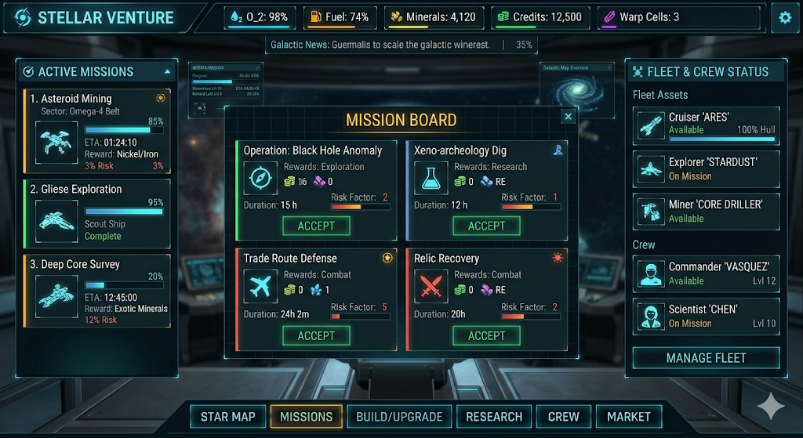

# UI — Hub Screen

> **Status:** The hub shell has shipped and evolved through P2–P4
> scaffolding. The 5-zone layout described in §1–§6 is the **live
> implementation** of the start screen. The top-bar resource strip is
> backed by persistent `MetaState` (P3). The ACTIVE MISSIONS left column
> now shows dispatched idle missions with progress, ETA, and
> ABORT/COMPLETE actions (idle dispatch UI shipped in P4 scaffolding;
> real `IdleClock` ticking pending). Three bottom-nav tabs are now
> shipped as extracted scene classes: **STAR MAP** (§5a), **BUILD/UPGRADE**
> (§5c, new), and **RESEARCH** (§5b). CREW and MARKET remain locked stubs.
> The MISSIONS tab now includes a **mission planner** with ship + crew
> assignment and IDLE/MANUAL dispatch toggle.
>
> Ground-truth reference: [`images/hub-mission-board-mock.png`](images/hub-mission-board-mock.png)
> (a reference mock — not a pixel-perfect target, just the shape of the screen).
> The earlier `images/hub-vision.png` mock is superseded by this one; see
> [ADR-0007](adr/0007-hub-wireframe-pivot.md) for what changed.



---

## Shape of the screen

Five persistent zones + one modal overlay:

```
 ┌──────────────────────────────────────────────────────────────────────┐
 │ TOP BAR: brand + resource strip + settings gear                      │ ← always
 ├──────────────────────────────────────────────────────────────────────┤
 │ GALACTIC NEWS ticker (one scrolling line)                            │ ← always
 ├──────────────┬───────────────────────────────────┬───────────────────┤
 │              │                                   │                   │
 │ LEFT         │       CENTER (tab content)        │ RIGHT             │
 │ Active       │                                   │ Fleet & Crew      │
 │ Missions     │   (swaps with bottom nav tab)     │ Status            │
 │              │                                   │                   │
 │              │    ┌─────────────────────────┐    │                   │
 │              │    │  MISSION BOARD modal    │    │                   │ ← MISSIONS tab only
 │              │    │  (2×2 narrative cards)  │    │                   │   (floats over center)
 │              │    └─────────────────────────┘    │                   │
 │              │                                   │                   │
 ├──────────────┴───────────────────────────────────┴───────────────────┤
 │ BOTTOM NAV: STAR MAP · MISSIONS · BUILD/UPGRADE · RESEARCH · CREW …  │ ← always
 └──────────────────────────────────────────────────────────────────────┘
```

- **Left and right columns are persistent context** — they reflect live state
  regardless of which tab is active in the center. Active missions keep
  ticking while you're on RESEARCH. Fleet hull % keeps updating while you're
  on STAR MAP.
- **Center is the only tab-swapped region.**
- **Mission Board is a modal over the MISSIONS tab** — it floats above a
  static galactic-map backdrop + the Galactic News ticker. ESC or clicking
  the backdrop dismisses it. This is the one place in the hub with modal
  chrome; everything else is in-place navigation.
- **The puzzle run is a separate scene** — clicking ACCEPT on a mission card
  transitions out of the hub into the existing game scene. Returning routes
  to the results screen (P1) and then back to the hub.

---

## Zones, element by element

### 1. Top bar — resource strip

Left to right:

- **Brand mark** — `STELLAR VENTURE` title + reactive star actor (the same
  actor currently used in the transitional start screen).
- **Resource readouts** — one chip per tracked resource. Each chip: small
  icon + label + value. Mix of **percentages** (ship/station stats) and
  **integers** (bankable currencies).

Resource strip in the reference mock (final list TBD as we tune the economy):

| Icon | Resource | Kind | Example shown |
|---|---|---|---|
| ore | **Minerals** | bankable, integer | `4,120` |
| coin | **Credits** | bankable, integer | `12,500` |
| bolt | **Warp Cells** | bankable, small integer (`warp / warpCapacity()`) | `3 / 5` |
| star | **REP** | rank + progress, wide chip (**P8**) | `REP 1,240 · SENIOR DISPATCHER` and `1,240/2,800` beneath it, or `MAX RANK` at tier 6 |

Chip behavior:

- Value changes pulse briefly (same event-driven repaint pattern the HUD uses).
- Below-threshold values tint red.
- Clicking a chip opens a one-line tooltip explaining what the resource gates.
- Chip widths are not uniform: the REP chip is `wide` (132 px vs 88 px) and the
  layout pass positions chips from a `widths[]` array, so the strip still fits
  at the hub's minimum scale.

- **RESET GAME button** — left of the gear. Wipes the saved profile and reloads.
- **Settings gear** — rightmost. Opens a modal with sound toggle, reset-profile
  confirmation, credits (the project kind), link to docs.

### 2. Galactic News ticker

One scrolling line directly under the top bar. Always present, ~28 px tall.

Content comes from a small rotating pool of flavor strings plus **real
runtime headlines** (P8). `HubScene.pushNews(text)` prepends to a 4-entry
runtime buffer that is joined ahead of the static pool, so the strip is a live
feed rather than decoration. Runtime sources today:

- `settlement` — `<Contract> paid 1,240 CR · +34 REP · +1 warp.`
- idle abort — `<Contract> returned early — 210 CR salvaged.`
- `rep-tier` — `Promotion: you are now Senior Dispatcher (REP tier 3).`
- `sector-discovered` — `New sector charted: nova bazaar.`
- `research-complete` — `Research online: hull plating.`
- gated taps — `<Contract> needs REP tier 4 clearance.`
- refused rerolls — `Reroll declined: not enough credits.`

Older flavor examples (still in the static pool):

- `⚡ Mineral prices up 3% in Outer Rim — switch carriers if you can.`
- `⚠ Solar flare active near Gliese Fringe — missions here risk +5%.`

Ticker scrolls right-to-left at a constant speed; gameplay events emit
higher-priority items that jump to the front.

Disable from settings if noisy. Purely flavor + feedback — **no input
lives here**.

### 3. Left column — ACTIVE MISSIONS

Header: `ACTIVE MISSIONS` with small chevron / count badge.

Each card in the list represents one **in-flight** mission:

```
┌────────────────────────────────────┐
│ 1. Asteroid Mining             ★   │  ← slot number + name + risk/priority icon
│    Sector: Omega-4 Belt            │  ← location / parent body
│    ████████████░░░░░  62%          │  ← progress bar
│    ETA: 01:24:10                   │  ← countdown to completion
│    Reward: Nickel/Iron             │  ← ore preview
│    Risk: 3%                        │  ← failure chance
│    [ ship silhouette ]             │
└────────────────────────────────────┘
```

States:

- **In progress** — animated progress bar + ticking ETA (`computeJobState`,
  repainted at 4 Hz).
- **Complete** — progress bar full, label swaps to `Search Complete` /
  `Haul Ready`, card gets a glowing border; **CLAIM** settles the contract
  through `settleMission()` → `meta.settleActiveMission()` (credits, ores, REP,
  crew XP, hull wear, warp — one save) and frees the ship + crew.
- **RETURN (abort)** — pays the elapsed fraction of the contract at 15 % rep
  with no ore or XP.
- **Empty slot** — stub card with `+ Deploy` button that routes to the
  MISSIONS tab and opens the mission board modal.

**WELCOME BACK banner (P8).** When `main.js` hands the hub an offline report
with finished contracts, row 0 of this list becomes a 96 px green-accent card:

```
┌────────────────────────────────────┐
│ WELCOME BACK                       │
│ Away 3h 12m · 2 contracts finished │
│ 1,240 CR · 4 ore lanes waiting     │
│ [        CLAIM ALL        ]        │
└────────────────────────────────────┘
```

`CLAIM ALL` settles every ready job through the same path as a single claim and
pushes one news headline. The banner is destroyed once the summary is cleared,
and the empty-state card shifts down by the banner height so nothing overlaps.

This panel is an **idle UI** — missions tick even while the player is
on another hub tab. The puzzle is only played for the **active run**
(one at a time, foreground scene). Passive missions are separate from
active puzzle runs — click ACCEPT on a card in the MISSION BOARD modal
and the run starts immediately; the IDLE toggle in the mission planner
sends the same contract out autonomously for a quoted ETA at 60 % rep.

Concurrency is capped by `_maxIdleAssignments()` (fleet berths), and the header
counter reads `N / cap`.

### 3a. Left column — tab-owned panel (P9)

The left bay is contextual. MISSIONS keeps **ACTIVE MISSIONS** (§3) and RESEARCH
keeps **ACTIVE PROJECTS**; every other tab that has contextual data of its own
takes over the bay through a small contract, so the hub still owns the frame and
the tab owns the content ([ADR-0010](adr/0010-hub-tab-scenes.md)):

```js
// tab scene
this.usesSidePanel  = true;      // opt in — the hub shows the bay at all
this.sidePanelTitle = 'MARKET';  // header text the hub writes
layoutSide({ width, height }) {} // called on activation + every resize
// ...build children into the injected `side.list` container
```

`HubScene._buildSidePanel()` creates the frame once — a `drawTechPanel` surface
276 px wide with a cyan accent, a header label and an empty `list` container at
`(12, 40)` — and passes it into the three tab constructors as
`{ side: sidePanel }`. `_setActiveTab()` shows the bay only when
`!showIdleLeft && !showResearchLeft && scene.usesSidePanel`, stamps
`sidePanel.ownerId = tabId` and the header text, then calls
`_layoutSidePanel()`; `_layoutShell()` re-lays it out on every resize using the
`_w` / `_h` recorded by `_layoutColumnPanel()`. CREW leaves the bay empty so its
roster can breathe.

Current owners:

| Tab | Header | Contents |
| --- | --- | --- |
| STAR MAP | `SYSTEM DATA` | selected-body survey read-out + `SYSTEM INDEX` list (§5a) |
| BUILD/UPGRADE | `SHIPYARD` | blueprints, berth capacity, yard status (§5c) |
| MARKET | `MARKET` | goods list / watchlist with BUY + SELL (§5d) |

A tab may mount either way: STAR MAP rebuilds its children into `side.list` on
every render, while SHIPYARD and MARKET build one persistent container and
re-parent it (`if (node.parent !== side.list) side.list.addChild(node)`) so
their refresh code keeps working on the same nodes. Both are idempotent under a
resize, and `tests/side-panel-contract.test.js` asserts the whole contract over
the sources (scene classes cannot execute under `node --test` — they need
WebGL).

### 4. Center — tab content

One panel at a time, driven by the bottom nav. At boot the **MISSIONS**
tab is active and the mission board modal is open. Dismissing the modal
leaves the MISSIONS tab showing the static galactic-map backdrop.

The six tab-panels:

- **STAR MAP** — one seeded planetary system: a central star, orbit rings and
  shaded planets (with moons, stations, hazards and ships), plus the SECTOR
  NETWORK rail. Tapping a body fills the left panel's `SYSTEM DATA` board.
- **MISSIONS** — default tab. Static galactic-map backdrop + `MISSION
  BOARD` modal overlay (see §5 below) + the **mission planner**: an
  IDLE / MANUAL toggle, ship and crew pickers, the contract list, and an
  outcome card quoting the dispatch through `resolveDispatch()` — ETA,
  threat, environment, payout with its sector-bonus line, and the mode
  line (`AUTONOMOUS · NO MINIGAME` vs `PLAY THE MINIGAME`). DISPATCH is
  gated on a free ship, an available crew member, an idle slot when IDLE
  is selected, and the contract's REP clearance.
- **BUILD/UPGRADE** — center: fleet list with hull bars, a selected-hull
  detail card (class + the mission types it fits, hull %, status), REPAIR
  at 3 minerals per point, DISASSEMBLE at 40 % of build cost, and a
  mother-ship sub-tab showing where the berths came from. Left panel
  (`SHIPYARD`): the six blueprints priced in minerals, berth capacity and
  the yard status line. Berth capacity is `crew.fleetSlotLimit(effects)` —
  10 base berths plus the `effects.fleetSlots` extras from Fuel Cell / Warp
  Coils / Habitat Extension / Shield Array — read through
  `MetaState.fleetSlots()` so the yard and the rest of the economy cannot
  disagree. Refused actions explain themselves on that status line. See [ADR-0007](adr/0007-hub-wireframe-pivot.md) for the
  pivot rationale.
- **RESEARCH** — tech tree (12 nodes, multi-slot, cancel/resume with
  progress saved) plus an **ACTIVE BONUSES** card listing
  `activeEffectSummaries()` — the actual modifiers the economy reads.
- **CREW** — roster with per-member XP bars, a detail card (level,
  XP into/for next level, the payout multiplier that level buys, and the
  mission types the role is trained for), and a recruit panel with three
  candidates priced by `hireCost(rosterSize)` against `crewSlots()`
  berths. Dismissals pay 30 % severance.
- **MARKET** — center: one TradingView-style price chart for the selected
  good (grid, area + line series, price/time axes, a last-price tag, UTC
  midnight drift markers and a pointer crosshair) above the refinery
  (`REFINE ALL ORE`, 4:1 common / 2:1 rare) and the status line. Left panel
  (`MARKET`): the seven-good list with per-UTC-day drift, held stock, buy /
  sell prices, the lot selector (10 / 50) and quoted BUY/SELL buttons per
  row; tapping a row charts that good. The headline still names the day's
  biggest mover plus the countdown to the reset (§5d).

All six tabs are real now; the `Unlocks at Rep Tier N` stub path is gone.

**Shipped as scene classes** ([ADR-0010](adr/0010-hub-tab-scenes.md)): STAR MAP
(§5a) `src/scenes/tabs/star-map-tab.js`, RESEARCH (§5b) `research-tab.js`,
BUILD/UPGRADE (§5c) `build-upgrade-tab.js`, MARKET (§5d) `market-tab.js`,
CREW `crew-tab.js`. All five follow the same duck-typed
`show/hide/layout/destroy/visible` contract (plus optional `tick` and, for the
three tabs that own the left bay, `usesSidePanel` / `sidePanelTitle` /
`layoutSide` — §3a), live in `HubScene._nodes.tabs`, and are refreshed from the
hub's single MetaState `change` handler via `_refreshVisibleTab()`. MISSIONS (§5) remains inline — its
modal + mission planner are built into `HubScene`.

### 5a. STAR MAP tab — planetary system view

Reference mock: `assets/mock-star-map-tab.png`. Renders inside the
hub's center panel when the **STAR MAP** bottom-nav tab is active.
Shows one procedurally generated planetary system
(`src/procedural-star-system.js`, seeded) in a clipped central window:

- **Title strip (top-left).** `STAR MAP · SYSTEM CHART` at 14px,
  uppercase, 2px tracking, cyan.
- **Clipped map window.** Cyan rectangle frame; content outside is
  masked away. Deep-space tint + deterministic backdrop star speckle
  with slight parallax on pan/zoom.
- **Planetary system (world space).** One star and everything that orbits
  it: a corona-lit central star, orbit rings per planet, asteroid-belt
  bands, **planets as shaded spheres**, moons around larger planets,
  station diamonds, hazard triangles, and ship arrows orbiting their
  parent POI. Body glyphs are counter-scaled against zoom so they stay
  readable at every zoom level; moons/ships fade in only when zoomed in
  past a threshold to keep the zoomed-out view clean. Labels render
  beneath star/planet/station glyphs (10px slate, dark stroke) with the
  body's classification on a second line (`GAS GIANT`, `OCEAN`, …).

  **P9 — planets read as planets.** Before this pass every body was the
  same four-point sparkle, so the chart looked like a starfield with
  orbit rings. `drawBodyGlyph(g, poi, size)` now draws by `poiType`:

  | Body | Glyph |
  | --- | --- |
  | star | three-layer corona + photosphere + hot core highlight |
  | planet | atmosphere halo, disc, type-specific surface dressing, limb light, night side |
  | moon | small cratered disc + night side |
  | station / hazard / ship | diamond / triangle / arrow (unchanged) |

  Surface dressing comes from `PLANET_TYPE_STYLE[poi.type]` — Ocean,
  Terrestrial, Desert, Gas Giant, Ice Giant — and picks a blob count,
  blob colour, band count, ice-cap alpha and (for the giants) a ring
  radius. Everything is drawn *inside* the disc by construction: bands
  and caps are ellipses whose half-width is `sqrt(r² − y²)`, and blob
  centres stay within `0.55r` with a `0.26r` radius, so Pixi needs no
  clip mask. `drawBodyShade(g, size)` draws the night side as a separate
  sibling node, rotated in `_updateBodies()` so its flat edge faces the
  central star (moons face their parent planet). On-screen size comes
  from `bodyGlyphSize(poi)` — planets scale with their physical radius,
  which matters because the counter-scaling would otherwise flatten
  every world to the same dot.

  **P9 — slower motion.** `tick()` advances `ORBIT_TIME_SCALE = 0.25`, so
  orbital ambience runs at a quarter speed. On the seeded system that means
  planets take **64 s – 3.4 min** per orbit on screen instead of 16 – 51 s,
  and moons **17 – 36 s** instead of 4 – 9 s — fast enough to read as motion,
  slow enough to click a body while it moves.
  The reveal thresholds dropped with it (`MOON_ZOOM_REVEAL` 1.8 → 1.0,
  `SHIP_ZOOM_REVEAL` 1.3 → 0.85) so moons and ships appear earlier, and
  the backdrop speckle was thinned (160 → 90 dots, fainter) because the
  system — not the sky — is the subject. Orbit rings are brighter, and
  the selected planet's ring highlights in cyan.
- **Camera.** Wheel zooms toward the cursor (clamped relative to the
  fit-all zoom), drag pans, `+` / `−` / reset buttons sit on the right
  edge of the window. First layout auto-fits the outermost orbit.
- **Map legend (bottom-left card).** ~200×108 hologram sub-panel
  listing body kinds with color swatches.
- **Hint line (bottom-center).** `DRAG TO PAN · SCROLL TO ZOOM`.
- **SYSTEM DATA board (left panel, P9).** The read-out used to float over
  the map, anchored to the selected body's *current screen position*, so
  it swam around the window and had to be re-clamped every frame. It now
  lives in the hub's left bay (§3a), which is where the player already
  looks for contextual data, and it is joined by an index of the whole
  system. `_renderSidePanel()` rebuilds it on selection and on resize:
  - Body name (13px, slate) + `OCEAN · ORBIT 42.0 AU` classification line
  - Description / services / faction / surface temperature
  - `THREAT` with five pips (rose at 4+)
  - Resource grid for planets and moons: `MINERALS`, `O2`, `FUEL`, `WARP`
  - `Orbiters: N · Moons: N · Orbit: ~34 s` — the period the player
    actually watches (`orbitPeriodLabel()` divides the raw `2π / orbitSpeed`
    by `ORBIT_TIME_SCALE` and prints seconds under 90 s, minutes above, so a
    moon never reads "~0 min")
  - `PLOT COURSE · <cost> WARP` button + the sector status line (the jump
    is a sector action, so it stays wired to the SECTOR NETWORK rail)
  - `SYSTEM INDEX` — every non-moon body (primary, planets, stations,
    belts, hazards) as a tappable row with a colour dot and its type, so
    nothing has to be hunted for among the orbit rings; row height adapts
    to the panel so the list never scrolls
- **SECTOR NETWORK rail (P8, right edge).** A 244 px hologram panel beside the
  system chart, shown only when the viewport is ≥ 780 px wide (otherwise the map
  reclaims the full width):
  - Header `SECTOR NETWORK` + `N / 13 CHARTED` progress read-out.
  - One row per sector: name (green once charted, dimmed when unaffordable) and
    `◆ <warp cost>` or `✓ CHARTED`. Row height adapts (13–22 px) so all thirteen
    always fit without scrolling.
  - Selected-sector detail block: `THREAT n/5 · WARP n`, specialty, the permanent
    bonus line (`bonusLabelFor`) and the discovery grant
    (`GRANT: 400 CR  120 MIN`), or `ALREADY CHARTED`.
  - `PLOT COURSE · <cost> WARP` button + a status line that prints the outcome
    (`NOVA BAZAAR CHARTED · +400 CR +120 MIN +25 REP`) or the refusal
    (`JUMP REFUSED: NEED 2 WARP CELLS`).

Interactions:

- **Click a body →** the left panel's SYSTEM DATA board fills with that
  body's survey, a cyan reticle rings it on the map, and its orbit ring
  highlights.
- **Click a SYSTEM INDEX row →** same selection, from the list.
- **Drag →** pans the camera (taps with >5px travel do not select).
- **Wheel →** zoom toward the pointer.
- **Click empty space →** clears the selection (the board falls back to a
  "tap a body" hint; the index stays).
- **Click a sector row →** selects it, fills the detail block, and prices the
  PLOT COURSE button.
- **Click PLOT COURSE →** `meta.chartSector(id)`: one atomic write that spends
  the warp, banks the grant (credits / minerals / ore / warp / REP) and charts
  the sector. Refusals cost nothing and report why — already charted, not enough
  warp cells, or `requires REP tier 3 clearance` for threat-5 sectors.
- **Leaving the tab →** `hide()` clears the selection so the board does
  not flash a stale body on re-show; the hub hides the bay itself.

Wired in P8:

- `STAR_MAP_SECTORS` is the real 13-entry roster from `src/star-map.js` (it was
  an empty placeholder array), and sector names match `mission.sector` 1:1, so
  charting a sector immediately buffs every contract that flies there.
- Warp has both a sink (jumps) and a source (found on Exploration / Salvage /
  Combat dispatches, plus some discovery grants).

Still open:

- The procedural system chart's body pins remain display-only — they are not the
  sector network, and PLOT COURSE acts on the selected **sector**, not the
  selected body. The board says so by pairing the two: the body's survey data
  and the sector jump button share one panel.
- Current-position marker on the thumbnail is static.
- Charting a sector does not yet spawn a sector-specific contract.

### 5b. RESEARCH tab — technology tree

Reference mock: `assets/mock-research-tab.png`. Renders inside the
hub's center panel when the **RESEARCH** bottom-nav tab is active.
The palette leans amber (vs. STAR MAP's cyan) to signal "tech /
engineering" context. Owns these elements:

- **Title strip (top-left).** `RESEARCH · TECHNOLOGY TREE` at 14px,
  uppercase, 2px tracking, amber. Sits where the MISSIONS tab would
  put `MISSIONS — MISSION BOARD`.
- **Four category columns.** Left-to-right: Propulsion, Resource
  Extraction, Defense, Economics. Column headers are 12px slate,
  center-anchored over the column's normalized x-position
  (`0.12 / 0.38 / 0.64 / 0.88` of the tree region's width).
- **Hex nodes.** Each research node is a pointy-top hexagon
  (`HEX_R = 22`). 12 seeded nodes span the four categories (3 per
  column). Each node shows a 2-char glyph at its center, an `L<n>`
  level pill just below the hex, and a wrap-capped name label under
  the pill.
- **Prerequisite edges.** Thin cyan polylines connect each node to
  its downstream dependents (`EDGES`). Edges route orthogonally
  (horizontal-then-vertical) when nodes sit in different columns, so
  cross-column dependencies read as clean right-angle steps.
- **Node states** (4, each with a distinct stroke + icon color):
  - `available` (cyan stroke, cyan glyph): prereqs met, ready to start.
  - `researching` (amber stroke, amber glyph): in progress; the
    detail card shows a progress bar + ETA.
  - `completed` (emerald stroke + fill): already unlocked.
  - `locked` (slate stroke): prereqs unmet; detail card's CTA is
    dimmed.
- **Detail card (right side, floating).** ~260×210 hologram sub-panel
  pinned to the right of the tree, vertically centered. Contents:
  - `RESEARCH NODE` header (amber, 11px, 1px tracking)
  - `<name> Lvl <n>` (14px, slate)
  - Status line: `Locked` (rose) / `Available` (cyan) /
    `Currently Researching` (amber) / `Completed` (emerald)
  - Cost row: `<minerals> minerals · <credits> credits · <time>`
    (hidden for completed nodes)
  - Progress bar + `<pct>%  ·  ETA HH:MM:SS` (only for researching)
  - Effect blurb (wrap-capped, 11px, slate dim)
  - CTA button: `INITIATE RESEARCH` (available) /
    `PREREQUISITES LOCKED` (locked, dimmed) /
    `VIEW PROGRESS` (researching) / hidden (completed)
- **Legend strip (bottom-left card).** ~220×76 hologram sub-panel
  listing the four node states with color dots. Mirrors the
  reference mock.

Interactions:

- **Click a hex →** selects that node; detail card rebuilds with its
  cost / status / CTA / effect. Selection highlight is a thin
  amber outer ring (`HEX_R + 4`) around the active hex.
- **Click the CTA on an available node →** stub for now (the button
  is a visual affordance). Real cost deduction + tick-based
  research clock lands under ROADMAP P8.
- **Leaving the tab →** `hide()` keeps the last-selected node around
  so the card re-opens to the same state on re-show.

Not yet wired (tracked under P8):

- All 12 nodes are static data. No `MetaState.research` slice exists
  yet — node states do not persist across reloads.
- Costs are not deducted. INITIATE RESEARCH is a no-op.
- Research ticking is not implemented (the `researching` state's
  progress + ETA are frozen at the mock values for the seeded
  Habitat Extension node).
- Completing a node does not apply the upgrade effect anywhere
  (`ion-thrusters` does not actually reduce ETA yet, etc.).

### 5c. BUILD/UPGRADE tab — fleet + shipyard

Reference mock: *none yet — built from the spec below.* Renders inside the hub's
center panel when the **BUILD/UPGRADE** bottom-nav tab is active. Two sub-tabs
sit under the title: **AVAILABLE FLEET** (cyan) and **MOTHER-SHIP** (magenta).

Center panel (`src/scenes/tabs/build-upgrade-tab.js`):

- **Fleet list (left of the panel).** One 216×38 row per hull: name, class
  (tinted by `CLASS_COLORS`), a hull bar that goes emerald → amber → rose, and
  its status. Tapping a row selects it; rows past the visible height are
  hidden rather than clipped.
- **Selected-hull card.** Class + the mission types that hull fits
  (`crew.SHIP_CLASS_AFFINITY`, via `specialtyFor()`), hull %, status,
  **REPAIR** (3 minerals per hull point, priced on the button) and
  **DISASSEMBLE** (40 % of build cost back as minerals). Repairs report to the
  lifetime stats through `MetaState.noteHullRepair()`.
- **MOTHER-SHIP sub-tab.** Berth summary (`N / cap` + where the berths came
  from), the fleet-slot tech cards, and the RESEARCH LAB expander. Berth
  capacity is `MetaState.fleetSlots()` (`crew.fleetSlotLimit`) — one source for
  the yard, the berth grid and the dispatch cap — with
  the tech table as the *display* of its provenance, not a second copy of the
  math (`fleetSlotLimit()` = 10 base berths + `effects.fleetSlots` extras).
- **Visual sub-panel (right).** Carrier silhouette, a berth grid lit up to the
  slot limit, and the fleet roll call.

Left panel — `SHIPYARD` (P9, §3a). The yard used to sit in the center panel's
leftover column, which made blueprints the narrowest thing on screen while the
fleet list hogged the space. It now owns the bay:

- `BUILD NEW SHIP` header + berth capacity line (`N / cap berths`).
- The yard status line: every refusal and every success explains itself here
  (`Need 220 more minerals for the Frigate.`, `All 10 berths occupied —`,
  `Scout-03 launched · 400 minerals · fits Exploration.`).
- Six blueprint cards, one per hull class, each with its class-tinted name,
  blurb, `400 minerals · fits Exploration` price line and a **BUILD** button.
  Card width is the panel's, not the map's, so the blurb wraps instead of
  truncating.
- Cards dim their BUILD button when the order would be refused (no berth, not
  enough minerals) — `_buildShip()` re-checks anyway, because a stale button
  must never be able to overspend.

The yard is only mounted for the AVAILABLE FLEET sub-tab; `_setSubTab()` calls
`_refreshSide()` so switching to MOTHER-SHIP hides it.

### 5d. MARKET tab — watchlist + price chart

Reference mock: *none yet — built from the spec below.* Renders inside the hub's
center panel when the **MARKET** bottom-nav tab is active
(`src/scenes/tabs/market-tab.js`). P9 split it the way a trading terminal is
split: the **list** went left, and the center became **one chart**.

Left panel — `MARKET` (§3a):

- `LOT` selector (10 / 50, amber when active) and the credit balance.
- Column headers `GOOD · HELD · BUY · SELL`, then one row per good (seven:
  pyrite, cryonite, verdanite, helium, volatiles, biomass, minerals), each with
  an ore-tinted swatch and name, held stock, today's buy and sell price, and
  compact **BUY** / **SELL** buttons.
- Row height is derived from the panel height (`ROW_H_MIN 22 … ROW_H_MAX 30`) so
  all seven goods are always visible without scrolling — the list is the tab's
  whole navigation.
- Tapping a row *charts* that good without trading it (selected row gets a cyan
  bar + tinted name); BUY / SELL still trade the row's own good and, on a fill,
  switch the chart to it. Buttons dim when `tradeQuote()` refuses the order
  (unaffordable buy, empty hold) and are inert, so a stale button can never
  overspend.

Center panel:

- **Balances strip.** `CREDITS`, `MINERALS` and the market headline — the day's
  biggest and smallest mover plus the countdown to the 00:00 UTC re-price,
  repainted once a second by `tick()`.
- **Price chart (TradingView-style).** Header: good name in its ore tint, last
  price (emerald up / rose down), `+8.2% 24H · +6.9% vs close`, the window
  `H / L / BASE`, and an order ticket line (`LOT 10 · BUY 64 CR · SELL 43 CR`).
  Plot: 5-row × 6-column grid, area fill + 2 px line through the series, price
  axis labels on the right, `HH:00` UTC labels along the bottom, an amber marker
  at every UTC-midnight crossing inside the window (the daily re-price, as
  opposed to the intraday wobble), a dashed last-price line with a filled price
  tag, and a pointer **crosshair** that snaps to the nearest point and reads
  `6.42 (B6/S5)` + the hour.
- **Refinery strip.** Ratio reminder (`common 4:1 · rare 2:1`), what a full melt
  would return right now, and **REFINE ALL ORE** — the main mineral faucet
  feeding BUILD/UPGRADE and RESEARCH.
- **Status line.** The last order's outcome, or its refusal
  (`ORDER REFUSED: NOT ENOUGH CREDITS`).

The series is *derived, never stored*: `economy.priceHistory()` re-runs the same
drift math for each hour bucket with a small hashed wobble on top, so it is
deterministic across machines and reloads and costs no save-file space. Its
right edge has zero wobble by construction, which makes the last plotted price
exactly the mid that `marketPrices()` — and therefore the BUY/SELL buttons —
quote. See `docs/META-SYSTEMS.md` §4.6.

### 5. MISSION BOARD modal (MISSIONS tab default overlay)

Floating panel over the MISSIONS tab. 2×2 grid of narrative mission
cards in the mock; final card count tuned per session roll (4–8 visible,
scrollable if more). See §7 below for the full catalog.

Modal structure:

```
┌─ MISSION BOARD ────────────────────── ×  ┐
│                                          │
│  ┌──────────────────┐ ┌───────────────┐  │
│  │ Op: Black Hole   │ │ Xeno-arch Dig │  │
│  │ Exploration      │ │ Research      │  │
│  │ Risk: 2  15h     │ │ Risk: 1  12h  │  │
│  │ [ore preview]    │ │ [ore preview] │  │
│  │ [ ACCEPT ]       │ │ [ ACCEPT ]    │  │
│  └──────────────────┘ └───────────────┘  │
│  ┌──────────────────┐ ┌───────────────┐  │
│  │ Trade Route Def  │ │ Relic Recov.  │  │
│  │ Combat           │ │ Salvage       │  │
│  │ Risk: 5  24h 2m  │ │ Risk: 2  20h  │  │
│  │ [ore preview]    │ │ [ore preview] │  │
│  │ [ ACCEPT ]       │ │ [ ACCEPT ]    │  │
│  └──────────────────┘ └───────────────┘  │
│                                          │
│  Daily contracts · free refresh in       │
│  11h 24m 06s · 2 rerolls used today      │
│  [   REROLL BOARD · 450 CR   ]           │
└──────────────────────────────────────────┘
```

Card elements (one per card):

- **Name** — flavor name. `Operation: Black Hole Anomaly`, `Xeno-archeology
  Dig`, `Trade Route Defense`, `Relic Recovery`, etc. See §7 for the
  canonical catalog.
- **Type tag** — one of: `Mining` · `Exploration` · `Research` · `Salvage` ·
  `Combat`. Drives the icon and the tier mapping.
- **Sector** — parent body / location string. `Omega-4 Belt`, `Gliese
  Fringe`, `Voidwreck`, etc. Stable per session.
- **Risk factor** — 1–5 stars (or a single integer). Hidden lookup to
  tier index underneath; 1 = T1/T2, 5 = T9.
- **Duration ETA** — flavor countdown (`15h`, `12h`, `24h 2m`, `20h`).
  Purely decorative in P2 (instant-run on ACCEPT); wires into the idle
  tick in P4.
- **Reward preview** — 2–4 ore icons with expected counts (e.g. `◆ Pyrite
  ×80 · ◆ Helium ×40`). Credit line below. Collapsed-complexity missions
  show rare ores (Volatiles, Biomass).
- **`COMBAT · MINIGAME` badge (P8)** — Combat variants advertise that
  ACCEPT launches the **defense minigame** rather than a puzzle board, so the
  player is never surprised by a different game.
- **REP lock overlay (P8)** — a contract above the dispatcher's rank renders a
  dimmed overlay, a `LOCKED · REP 3` button and a `not-allowed` cursor. Tapping
  it pushes `<Contract> needs REP tier N clearance.` to the news ticker instead
  of launching.
- **ACCEPT button** — primary verb. Click → the minigame scene launches
  with the card's `gameConfig` (mode / complexity / field size from the
  mapped tier archetype).

Modal behavior:

- Opens automatically when the MISSIONS tab activates at boot.
- Dismissed by the `×`, by ESC, or by clicking outside the panel.
- **Subtitle (P8)** — `Daily contracts · free refresh in HH:MM:SS · N rerolls
  used today`, repainted at 1 Hz while the modal is open, straight from
  `meta.getBoardState()`.
- **REROLL BOARD (P8)** — the free daily roll happens by itself at the UTC
  boundary. Extra same-day rolls cost `150 × (n + 1)` credits
  (150 / 300 / 450 …), charged by `meta.buyBoardReroll()`, capped at
  `MAX_REROLLS_PER_DAY = 6` plus `effects.riskRerolls`. The label shows the
  exact price (`REROLL BOARD · 450 CR`), flips to `REROLL LIMIT REACHED` at the
  cap, and dims + refuses when unaffordable. A reroll rebuilds the **whole**
  catalog from the new daily seed, so Combat variants and sectors move too.
- The four face-up cards are a seeded `pickMissionBoard()` subset of the
  nine-tier catalog; in-flight contracts stay intact across a reroll.

### 6. Right column — FLEET & CREW STATUS

> Replaces the earlier "BASE COMMAND" spec (build queue + upgrade list
> on the persistent right column). The queue + upgrade list moved into
> the BUILD/UPGRADE tab per [ADR-0007](adr/0007-hub-wireframe-pivot.md).

Header: `FLEET & CREW STATUS`.

Two stacked sub-sections.

**Fleet**

One card per ship in the player's fleet. Each card:

```
┌──────────────────────────────┐
│ [icon] Scout "Magellan"      │  ← class + callsign
│        Class: Explorer  Lv3  │  ← type + refit level
│        Hull: ████████░░  82% │  ← hull bar
│        Status: Deployed      │  ← On Station / Deployed / Repairing / Idle
└──────────────────────────────┘
```

Per-ship fields: class (Explorer / Hauler / Destroyer / etc.), callsign,
refit level, hull % with color ramp (green > 60%, yellow 20–60%, red <
20%), availability status. Clicking a ship card opens a detail panel
(future PR — refit, rename, assign crew).

Starter fleet: **3 ships** total (one Explorer, one Hauler, one
multipurpose frigate). Fleet size gates concurrent active missions.

**Crew**

List of hired operators:

```
┌──────────────────────────────┐
│ [portrait] Kira Voss    Lv4  │  ← name + skill level
│            Engineer          │  ← role
│            Status: Assigned  │  ← Assigned / Available / Injured
└──────────────────────────────┘
```

Per-crew fields: name, role (Engineer / Navigator / Scientist /
Gunner / Medic / Archaeologist), skill level, status. Assigned crew
take a bonus on missions whose type matches their role (e.g.
Archaeologist on `Xeno-archeology Dig`).

Starter crew: **3 members** (1 Engineer, 1 Navigator, 1 Scientist) plus
the player as **Chief Dispatcher** (not a crew card — lives in the top
bar brand area).

FLEET & CREW ticks live — hull repair, return-from-mission status
updates — in P4. For P2 scaffolding this is a static readout.

### 7. Narrative mission catalog

9 narrative missions, one per tier archetype in `HIGHSCORE_TIERS`
(`src/constants.js`). Each narrative mission is a **flavor skin** over a
`gameConfig = { mode, complexity, fieldSize }` triple; the puzzle run
stays identical to today's. The mission board modal shows a rotating
subset (4–8 cards) per session roll.

Design rules:

- **Exactly one narrative mission per tier archetype.** No two narrative
  missions map to the same tier. The tier order in `HIGHSCORE_TIERS`
  (easy → hard) stays the source of truth; the narrative name is
  decorative.
- **Combat variants layer on top (P8), they do not add tiers.** Up to
  `COMBAT_VARIANTS_PER_DAY = 2` of the tiers at index ≥ 5 that have an entry in
  `COMBAT_VARIANTS_BY_TIER_ID` roll a Combat variant for the day's seed
  (`pickCombatVariantTierIds`, a seeded Fisher-Yates — [ADR-0002](adr/0002-seeded-mission-rng.md)).
  A variant swaps `narrativeName`, `type: 'Combat'`, `sector` and `brief`, and
  sets `variant: 'combat'` / `runsDefense: true` so ACCEPT launches the **defense
  minigame**. It keeps the tier's `risk`, `etaLabel`, `baseCredits` and —
  critically — `mission.id = mission-<tierId>`, so [ADR-0003](adr/0003-tier-to-mission-1to1.md)
  still holds: nine tiers, nine missions, some days two of them are combat.
  The table below is the **standard** catalog; on any given day up to two rows
  read as their variant instead (e.g. T6 `Relic Recovery: Voidwreck` →
  `Voidwreck Pickup: Contested Salvage`).
- **REP gates (P8).** `blocks-mutated` (T8) needs REP tier **3** and
  `blocks-collapsed` (T9) needs tier **4**; everything else is open from tier 1.
  Gated cards render the lock overlay described in §5.
- **Mission type** correlates loosely with mode/complexity but is not a
  hard rule — it's a flavor bucket for crew-bonus matching.
- **Risk factor** (1–5) maps to tier index bucket: T1–T2 = 1, T3–T4 = 2,
  T5 = 3, T6–T7 = 4, T8–T9 = 5.
- **Duration ETA** is real since P4/P8: the card's `etaLabel` is flavor, while
  the *quoted* idle duration comes from `resolveDispatch()` —
  `IDLE_DURATION_SEC_BY_RISK[risk] + (tierIndex − 1) × 15 + (environment − 1) × 25
  + fit penalty (−12 / +16)`, then × `effects.etaMultiplier` × the charted
  sector's bonus, floored at 45 s. The planner prints that number, not the label.
- **Ore preview** reads from the tier's complexity: Classic previews
  common ores (Pyrite, Cryonite, Verdanite, Helium); Mutated mixes all
  four commons; Collapsed previews the two rare ores (Volatiles, Biomass)
  since that's the only complexity where bomb/snake tiles spawn. Combat
  variants always carry 3 commons + both rares (`expectedRewardOres`), and
  `effects.rareOreReveal` (Deep Scanner) widens what the preview shows.
- **Sector** is a real place: every sector name in this table exists in
  `src/star-map.js`, so charting it on the STAR MAP permanently buffs the
  contracts that fly there.

Canonical catalog (order matches `HIGHSCORE_TIERS` easy → hard):

| # | Tier id               | Narrative name                         | Type        | Sector               | Risk | ETA    | Ore preview                 |
|---|-----------------------|----------------------------------------|-------------|----------------------|------|--------|-----------------------------|
| 1 | `stellar-classic`     | **Asteroid Mining: Omega-4 Belt**      | Mining      | Omega-4 Belt         | 1    | 8h     | Pyrite, Helium              |
| 2 | `stellar-mutated`     | **Ice-Shard Harvest: Gliese Fringe**   | Mining      | Gliese Fringe        | 1    | 12h    | Cryonite, Verdanite, Helium |
| 3 | `auto-match-classic`  | **Gliese Exploration: Scout Sweep**    | Exploration | Gliese-876 System    | 2    | 12h    | Pyrite, Cryonite            |
| 4 | `auto-match-mutated`  | **Xeno-archeology Dig: Uncharted Crag**| Research    | Kuiper Fringe        | 2    | 16h    | Verdanite, Helium, Pyrite   |
| 5 | `stellar-collapsed`   | **Operation: Black Hole Anomaly**      | Exploration | Event Horizon Shadow | 3    | 15h    | Volatiles, Biomass          |
| 6 | `auto-match-collapsed`| **Relic Recovery: Voidwreck**          | Salvage     | Voidwreck Field      | 4    | 20h    | Volatiles, Biomass          |
| 7 | `blocks-classic`      | **Trade Route Defense: Outer Rim**     | Combat      | Outer Rim Lanes      | 4    | 18h    | Pyrite, Helium, Cryonite    |
| 8 | `blocks-mutated`      | **Deep Core Survey: Seismic Rift**     | Exploration | Seismic Rift         | 5    | 22h    | Verdanite, Pyrite, Helium   |
| 9 | `blocks-collapsed`    | **Core Breach: Terminus Protocol**     | Combat      | Terminus Core        | 5    | 24h 2m | Volatiles, Biomass          |

Implementation note: `src/missions.js` indexes into `HIGHSCORE_TIERS` and
exposes `ASTEROID_NAMES` per tier. `buildMissions({ seed, repTier })` returns the
frozen nine-mission catalog for a board seed — the seed decides both the
asteroid names and which tiers roll a Combat variant — and `pickMissionBoard()`
picks the four face-up cards. The run `gameConfig` is unchanged: same 9-tier
matrix underneath, and `runsDefense` is the only thing that routes ACCEPT to a
different minigame.

### 8. Bottom nav — tab switcher

Six pill-shaped buttons: `STAR MAP · MISSIONS · BUILD/UPGRADE · RESEARCH · CREW · MARKET`.
Active tab is highlighted (orange fill + white text in the mock; we'll use our
existing cyan accent for consistency).

- Default active tab at boot: **MISSIONS** (with the mission board modal
  open). Changed from the earlier "STAR MAP default" — the mission
  board is the primary verb of the game, so it greets the player first.
- Keyboard shortcuts: `1`–`6` jump to the corresponding tab.
- Mobile: horizontal scroll if the screen is too narrow. (Deferred — desktop
  first.)

- Small decorative star actor on the far right of the nav, echoing the brand.

---

## Information density vs. the current start screen

Today's start screen has 2 zones (mission grid + dispatcher identity card)
crammed into an ~860×820 fixed panel. The hub has **5 persistent zones + 1
modal + 6 tab-panels**. Two implications:

1. **The hub must be viewport-filling.** Not a fixed panel floating on a
   black background. That's what the current centering bug is hinting at
   — fixed panel sizes break on wide monitors.
2. **The hub is not a single `_buildStartScreen()` call.** It's a scene
   with child containers per zone, per tab, and per modal, each owning
   its own repaint lifecycle. Separating these is the first structural
   PR on the way to the hub.

See `ARCHITECTURE.md` for the scene-graph shape we'll adopt.

---

## Data model impact

The hub needs more state than the current `GameState`. What actually shipped
(names in **bold** exist; the rest were absorbed rather than built):

- **`MetaState`** — bankable resources (credits, ores, minerals, warp cells),
  banked REP with a derived tier, research unlocks, hired crew (+ XP), charted
  sectors, daily board state, active missions, lifetime stats, and the fleet
  (ships + hull %). Save v2 with in-place migration.
- **`missions.js`** absorbed the MissionRegistry role: `buildMissions({seed,
  repTier})` is the daily catalog, `buildIdleMissions()` the idle offers, and
  `MetaState.activeMissions` is the in-flight list. No separate registry module.
- **`crew.js` + `MetaState.fleet/crew`** absorbed FleetRegistry: affinity tables
  and hire/berth math are pure functions, rosters live in the profile.
- **`settlement.js`** is the reward path the BuildQueue/IdleClock sketch never
  had: `resolveDispatch()` quotes a dispatch, `settleMission()` pays for it.
- **`idle-clock.js`** is the IdleClock — but with **no scheduler**: jobs carry
  absolute timestamps, so `computeJobState()` / `summarizeOffline()` replace a
  ticking loop entirely.
- **`research.js` / `economy.js` / `star-map.js` / `reputation.js` / `daily.js`**
  own the tech effects, market + refinery, sector network, REP ladder and daily
  board rules.
- **NewsFeed** stayed a view concern: `HubScene.pushNews()` prepends runtime
  headlines to a static pool. No module.

All of the above stay **pure** (no DOM, no `setTimeout`, and `nowMs` / `dayKey` /
`rng` injected) — same rule as `GameState`. See
[`META-SYSTEMS.md`](META-SYSTEMS.md) and
[ADR-0011](adr/0011-meta-economy-single-source.md).

---

## Phased delivery

Not a single PR. Rough phase mapping (see `ROADMAP.md` for the committed
version):

| Phase | Hub scope | Status |
|---|---|---|
| P1 | Results screen after a run; session-only ore tally. No hub yet. | **Shipped** |
| P2 | Hub scaffolding: viewport-filling scene, top bar, Galactic News ticker, left ACTIVE MISSIONS, right FLEET & CREW STATUS, bottom nav with 6 tab buttons, MISSIONS tab + MISSION BOARD modal. | **Shipped** |
| P3 | Persistent `MetaState` + `Persistence`; rep-tier gates on narrative mission cards; session-carried fleet/crew state. | **Shipped** |
| P4 | Active-missions idle tick: left column ticks ETAs; completion → results → hub with rewards; FLEET & CREW status updates on return. | **Shipped** (absolute-timestamp jobs; no scheduler needed) |
| P5 | BUILD/UPGRADE tab: station diorama, per-building levels, build queue, upgrade list. `BuildQueue`. | **Shipped** (P8: berths from `effects.fleetSlots`, mineral-cost repairs, blueprint specialties, yard status line; timed build queues still open) |
| P6 | RESEARCH, CREW, MARKET tabs. Rep-tier gating. | **Shipped** (P8: crew XP/levels/berths/hiring, market rewritten on `economy.js` + refinery, research ACTIVE BONUSES card) |
| P7 | STAR MAP tab: sector exploration, mission discovery tied to map. | **Shipped** (P8: SECTOR NETWORK rail, warp-costed PLOT COURSE via `meta.chartSector()`) |
| P8 | Meta loop completion: REP ladder + gates, daily seeded board with paid rerolls, one settlement path, market/refinery, sectors, crew progression, offline WELCOME BACK, save v2. | **Shipped** ([`META-SYSTEMS.md`](META-SYSTEMS.md)) |

Each phase is still a handful of small PRs, not one giant PR.

---

## Non-goals for the hub

- **Not an RTS.** You do not command ships in real-time. Missions are
  launched, return with results. The only real-time interaction is the
  puzzle run.
- **Not a simulation.** Buildings don't produce ambient particles, NPCs
  don't walk around. Station view is a diorama, not a living scene.
- **Not animated 3D.** Planet + station are illustrative — parallax
  drift at most, no WebGL shaders beyond what Pixi already does.
- **Not a dialogue-driven narrative.** Mission cards have one-line
  flavor briefs; no VO, no NPC portraits with speech bubbles, no
  branching conversations.
- **Not mobile-first.** Desktop remains the primary design target, but
  the shipped hub/game surfaces now scale to fit narrow mobile
  viewports and gameplay has touch gestures so runs remain playable on
  phones.

---

## Open questions (answer as we go)

- ~~Where do high scores live once MISSION LOG is no longer a side panel?~~
  Answered: **nowhere**. The `HighScores` module was deleted and no
  leaderboard ships. If personal-best recall returns later it will be a
  derived read-out of `MetaState`, not a standalone module.
- ~~Is the right column BASE COMMAND (build queue + upgrade list) or
  FLEET & CREW STATUS?~~ Answered: **FLEET & CREW STATUS**. Build queue
  and upgrade list move inside the BUILD/UPGRADE tab. See
  [ADR-0007](adr/0007-hub-wireframe-pivot.md).
- ~~What's the max concurrent active missions?~~ Answered: capped at
  fleet size (currently 3 starter ships). The idle dispatch UI enforces
  this; upgrading via Hangar level is a future phase.
- ~~Should the results screen (P1) show a "best run on this asteroid" line
  sourced from session `MetaState`?~~ Answered in P8: the MISSION REPORT shows
  the **settlement** instead — REP (+ promotion), crew XP and level-ups, hull
  wear, warp found, charted sector and an itemised credit breakdown. `bestScore`
  is recorded in lifetime stats but not displayed.
- ~~Does the hub auto-pause when the player is in a puzzle run, or do idle
  missions tick during the run?~~ Answered: they **tick**, and there is nothing
  to cap — jobs store absolute end times, so an idle contract that finishes
  mid-run is simply claimable when the player returns. Offline works the same way.
- ~~Does the narrative catalog rotate between sessions, or only on daily
  reroll?~~ Answered: it is **daily**, not per-session. The board rolls from a
  per-UTC-day seed, so the catalog is identical across reloads and refreshes free
  at the boundary; paid rerolls re-seed it (and can move Combat variants).
- Should a charted sector spawn its own contract, or keep only buffing the
  contracts that already fly there?
- Do the 15 lifetime stats deserve a surface (station log / career panel)?
- Should a badly damaged hull be grounded (blocked from dispatch), or stay a
  pure repair tax?
